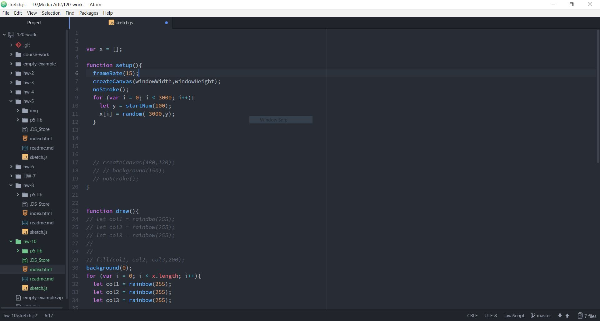
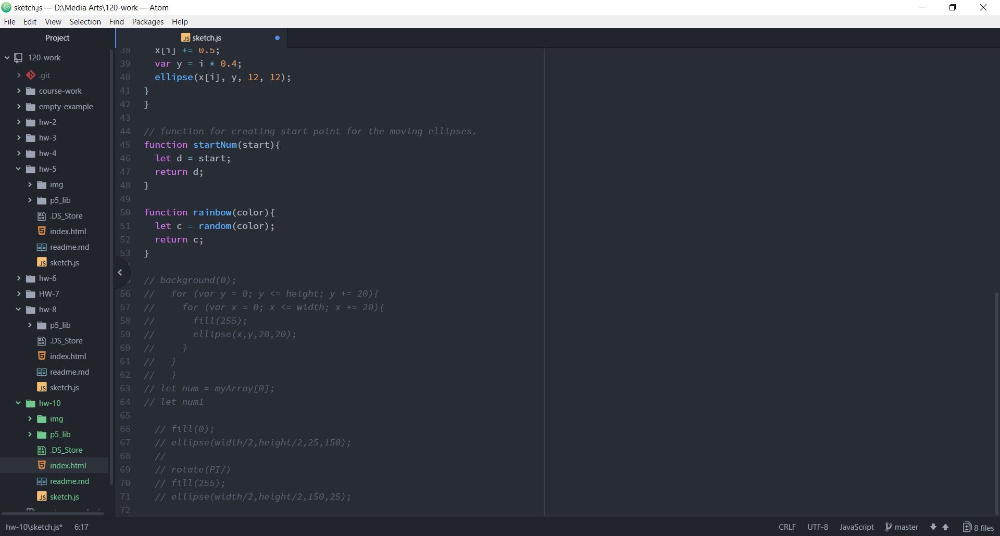
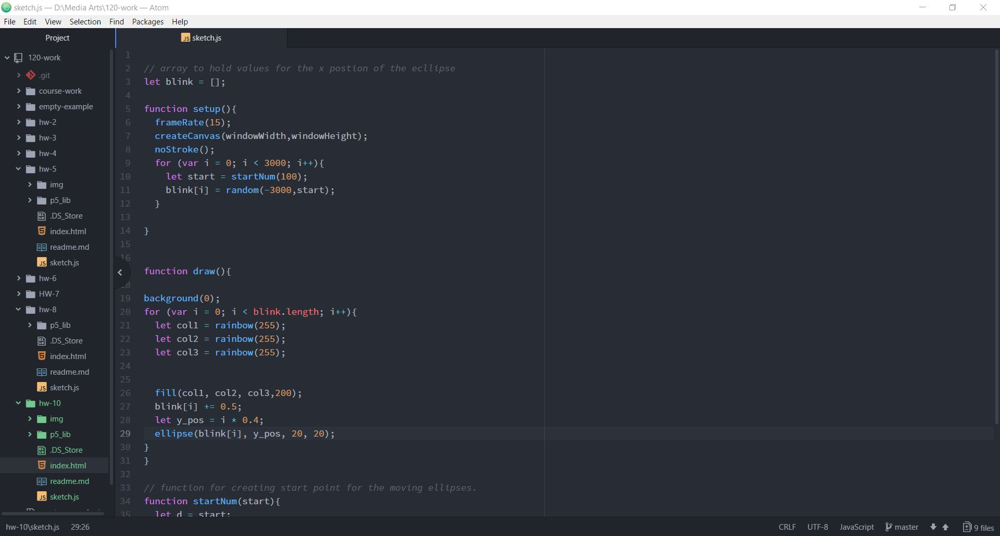
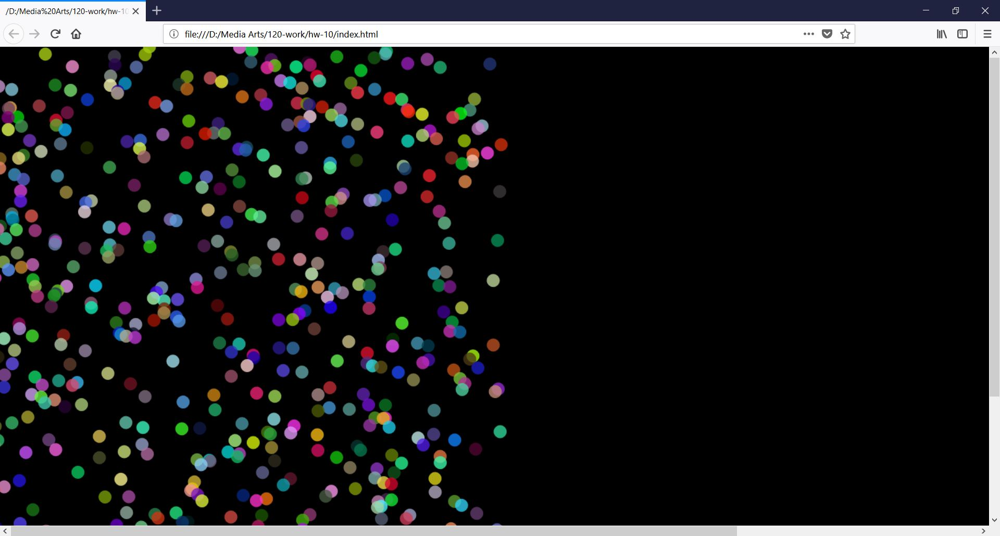

Marc Lenahan, 50

[Live Sketch]( https://marclenahan.github.io/120-work/hw-10/)

# Homework 10 Responses
This week we learned how to work with arrays and creating our own functions to be used in our assignment. To complete the assignment, I decided to create a new image. The past assignments I did not want to recreate. I wanted to create something that really stood out with color and motion. I decided to go with ellipses being created in a random pattern.

The first step was to play with the different loops to get down the overall sketch. I then started to make the little tweaks to help solidify the shape of the sketch so that it will be easier to add the remainder of the assignment parts. Once everything seems set I just added the final polish so that it all run smoothly.

I ended up having a lot of syntax errors with my code which was easily manageable yet still frustrating. Except for that I didn’t really have much problems.

I am probably going to start utilizing functions and arrays more. I feel like those are the essentials in these sketches and will definitely help out in the long run.
