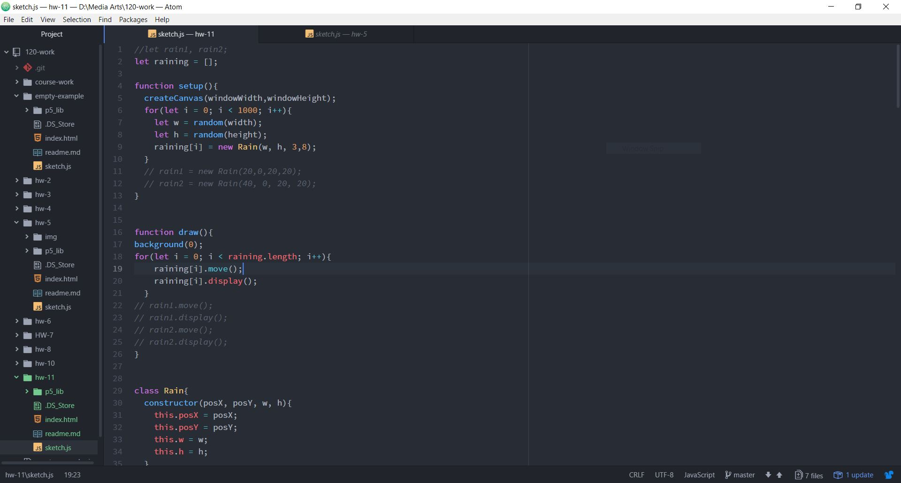
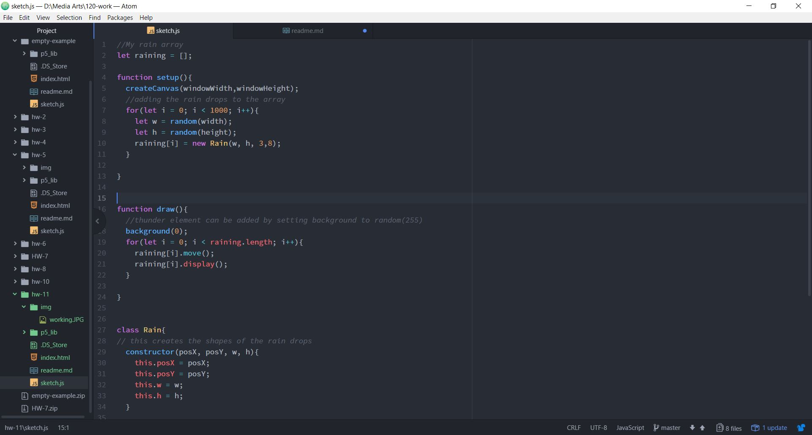

Marc Lenahan, 50

[Animation Sketch]( https://marclenahan.github.io/120-work/hw-11/)

# Homework 11 Responses

This week we learned about OOP and how to create our sketches through this method. After our lecture I wanted to continue on our examples and try to create my first ever particle generator using this method. I’ve always been fascinated by these generators and that’s why I wanted to take the steps towards creating a basic one.

First, I had created in a way what I want to generate which were simple rain drops. I then wanted to have them fall and reset like it was endless which took me a while, but I managed to incorporate what I have learned to create this effect. Next was just making the movement in the functions and testing out on the canvas how it would work.

The problems I had were probably common with the class because I took feedback from questions asked and managed to have my code work out. What was having trouble at first was having the rain to reset and having it continuous.

This was basically a top off of what we learned how to create our own functions. I really liked the direction we are going in this class and I’m taking a bigger interest in this portion of the lectors especially.
