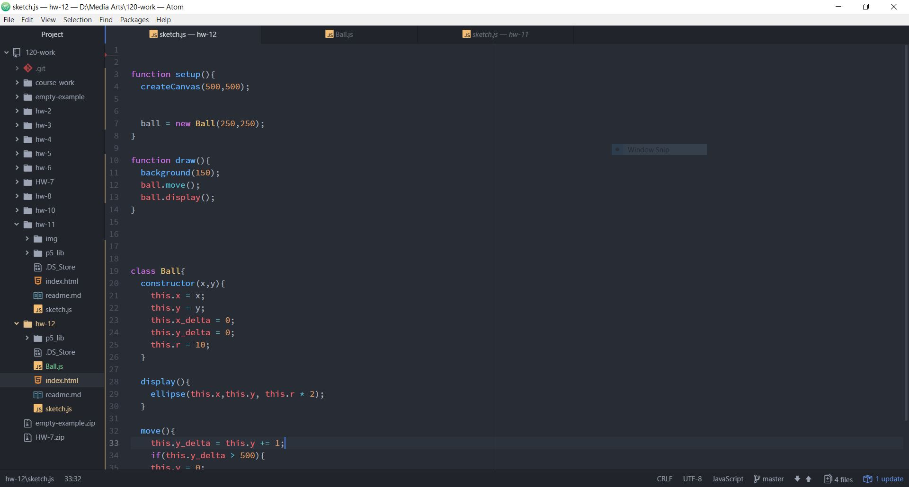
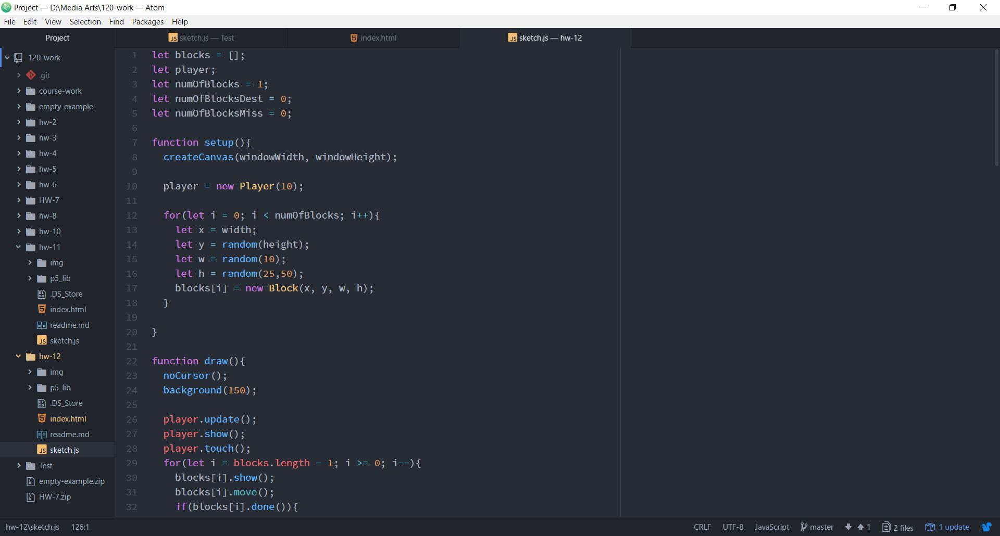
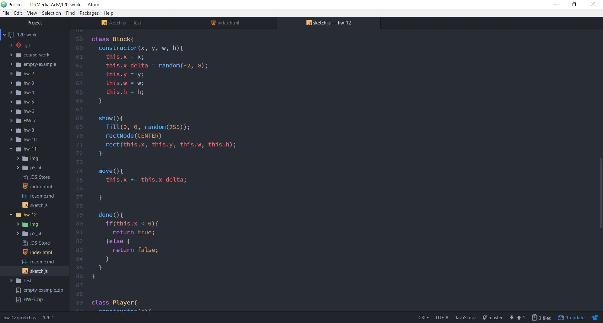
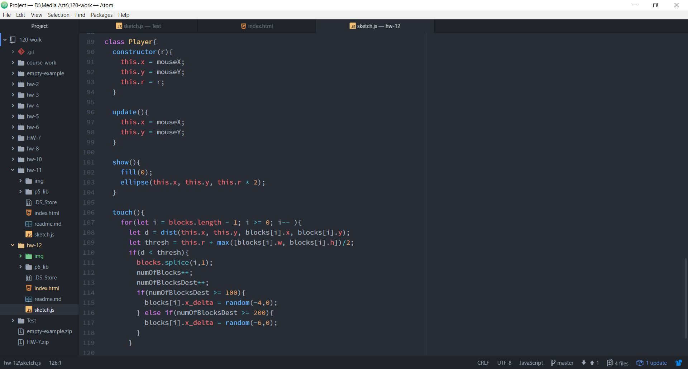

Marc Lenahan, 50

[Live Sketch]( https://marclenahan.github.io/120-work/hw-12/)

# Homework 12 Responses

For my assignment I was originally going to create a game that was similar to a classic called Pushy Penguins which was a mini game for Mario Party 5 on the Nintendo 64. The idea was to navigate the player which is controlled by the mouse, through a moving obstacle course and when the player would touch a block, the game would be over. Unfortunately, due to some problems and how much I could get away with, I ended up having to down scale the idea. In the end my sketch was every time the player would hit a block it would count it as a score. When a block was exiting the screen on the left it would count as a missed block.

To make this assignment I first started out with making simple sketches to get some of the mechanics working in the display side of things and the motion.

Next, I started to play with adding in an array to display multiple blocks like a particle generator.

Once some fine tuning was done on the movement of the blocks I started to create the basics of the player class.

The player class was finally added with the methods to determine when the player would get points and when the player would have missed blocks.

I had a few issues that were because of my curiosity of things that were outside of our lectures. We learned a lot about ellipse interacting with other ellipses, but I want to throw in a square which some how changed everything. I think creating thresh holds in my classes were also difficult and I had to seek some help for that as well.

I would like to work more on OOP so that I can become better at it. I think I am starting to get a better grasp of it and able to figure out the processes in my head better. I think I would benefit more by just understanding the structure and p5 library better and utilize it in the best ways possible.
