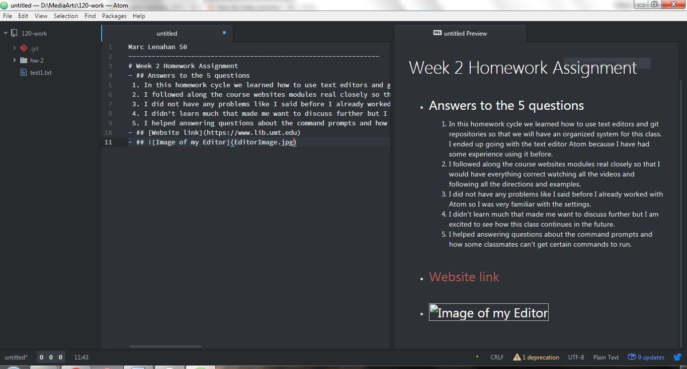

Marc Lenahan 50
_________________________________
# Week 2 Homework Assignment
- ## Answers to the 5 questions
 1.	In this homework cycle we learned how to use text editors and git repositories so that we will have an organized system for this class. I ended up going with the text editor Atom because I have had some experience using it before.
 2.	I followed along the course websites modules real closely so that I would have everything correct watching all the videos and following all the directions and examples.
 3.	I did not have any problems like I said before I already worked with Atom so I was very familiar with the settings.
 4.	I didn’t learn much that made me want to discuss further but I am excited to see how this class continues in the future.
 5.	I helped answering questions about the command prompts and how some classmates can’t get certain commands to run.
- ## [Website link](http://www.lib.umt.edu/)
- ## 
