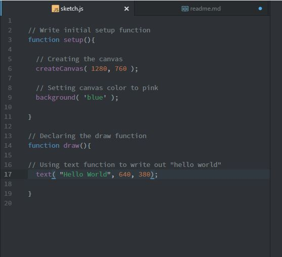
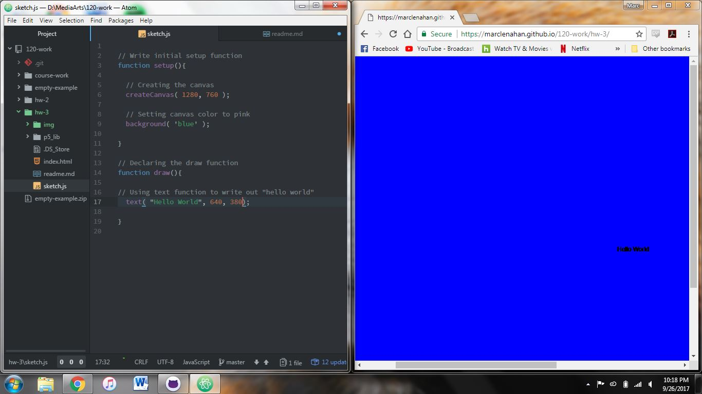

Marc Lenahan, 50

["Hello World!"](https://marclenahan.github.io/120-work/hw-3/)

# Homework 3 Responses

This week we dove into using our text editor and learned the basics of p5 functions. I created a classic “Hello World!” file using p5 to start off learning the language. I decided for the final product to create a large canvas with the color blue as the background.

I followed along the instructional videos to help create my first assignment. I started out making the first setup then added a canvas with a string added as well. After everything was set I made the canvas blue and increased the size to 1280 pixels.

The only problems I had this week were some misspelling of words that prevent the browser to not show what I wanted. Other than that not many problems at all. I ended up not posting about my problems on the repo.

I learned a lot about p5 this week and made me very interested on where we go. The initial video of p5 sparked my interest so much with the interactivity and I would love to learn more on how that all works.

I tried to help other students with some atom issues and hopefully pointed them in the right direction in trying to find an ultimate solution.
