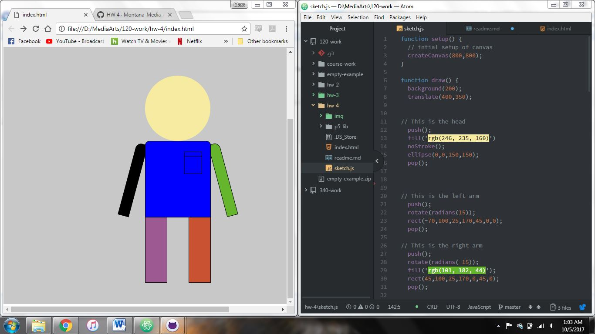
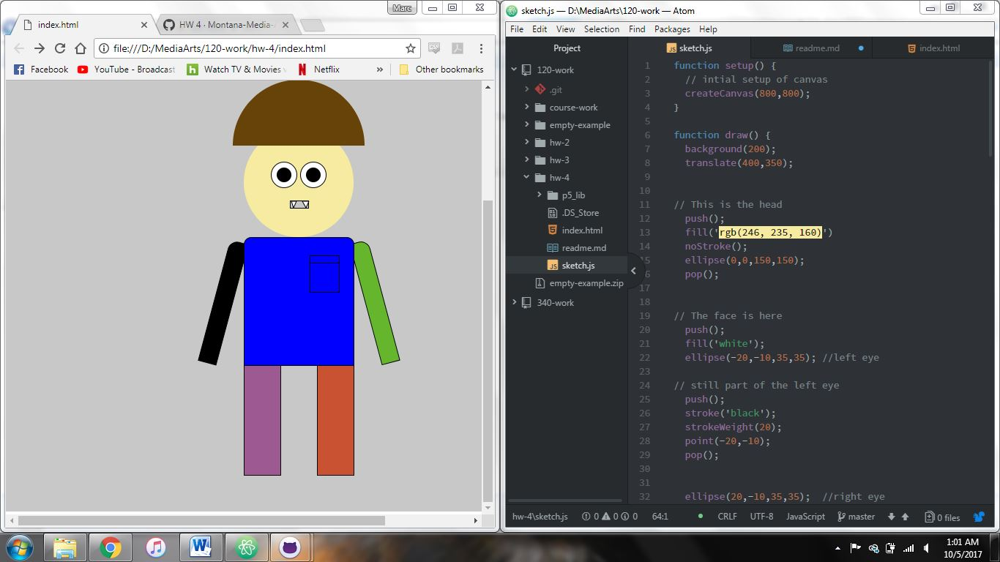

Marc Lenahan, 50

[Portrait Sketch]( https://marclenahan.github.io/120-work/hw-4/)

# Homework 3 Responses

TThis week the class went over drawing basic sketches using p5. For my assignment I decided to start of creating a self-portrait. After making the basics of the portrait I thought it would be fun to play around with other shapes and colors and added some weird features to my portrait. I figured that it was way more interesting seeing what I could get away with when creating the creature overall.

I first created the basic shapes in the browser with a lot of trial and error. I started with making a rectangle body and a circle for the head. I then moved them along the axis to center them and align them correctly. Then I added arms and legs giving more shape to the figure. After that I started to add color which helped differ the body parts and was able to align them better. Once every body part was in place, I zoomed in on the browser to add the facial features in correct spots.

I ended up not having many difficult problems. A lot of the mistakes I had were using correct syntax but the fixes were very easy. A lot of the difficulty was scaling a arranging all the shapes along the canvas which took a lot of time.

I learned a lot from this assignment and I can’t wait to learn more. I really want to see how p5 can be applied to other forms of work and explore the limitations it has.

I tried to help other students with some atom issues and hopefully pointed them in the right direction in trying to find an ultimate solution. A lot of issues seem to be syntax but others seem to be really weird that I was unfortunately not able to help with. I will however try to play around with things to get a better feel for odd issues.
