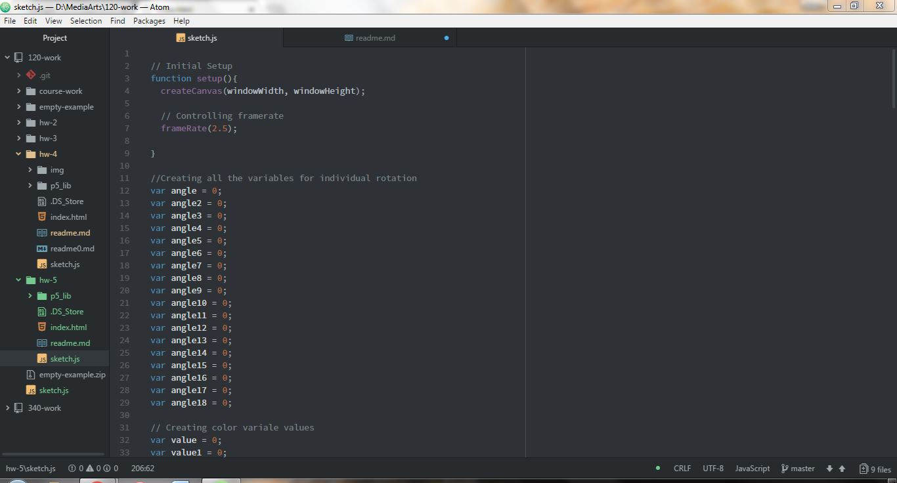
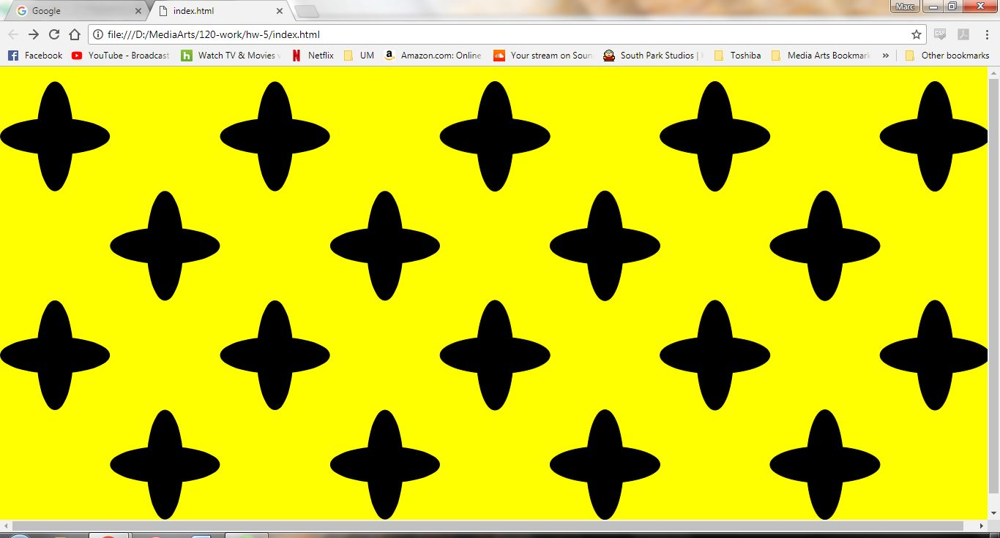

Marc Lenahan, 50

[Animation Sketch]( https://marclenahan.github.io/120-work/hw-5/)

# Homework 5 Responses

This week the class went over more abilities for sketches using p5. For my assignment I decided to start of creating a illusion. After making the basics of the window I thought it would be fun to play around with timing and the clicking functions aswell as color. It was a lot harder creating some of the code this week then before and I to expand some more on the overall layout.

I first created the basic shapes in the browser with a lot of trial and error. I started with making a rectangle as a shape but as I kept missing my mark I started to look at ellipses. I then moved along and created a pattern along the page. Then I added color that was startin to get more elaborate for me. After that I started to add the click function which was not working for a while untill i tried to use the absolute basic parameters.

I ended up having many difficult problems. A lot of the mistakes I had were using correct syntax. A lot of the difficulty was scaling a arranging all the shapes along the canvas which took a lot of time. Adding different functions and adjusting them also proved to be very difficult.

I learned a lot about more abilities are in p5. I am slowing starting to knock out the library and what each function does in its own way.

I tried to help other students with some atom issues and hopefully pointed them in the right direction in trying to find an ultimate solution. A lot of issues seem to be syntax but others seem to be really weird that I was unfortunately not able to help with. I also asked for some help with some coding synax with putting a funtion within a function.
