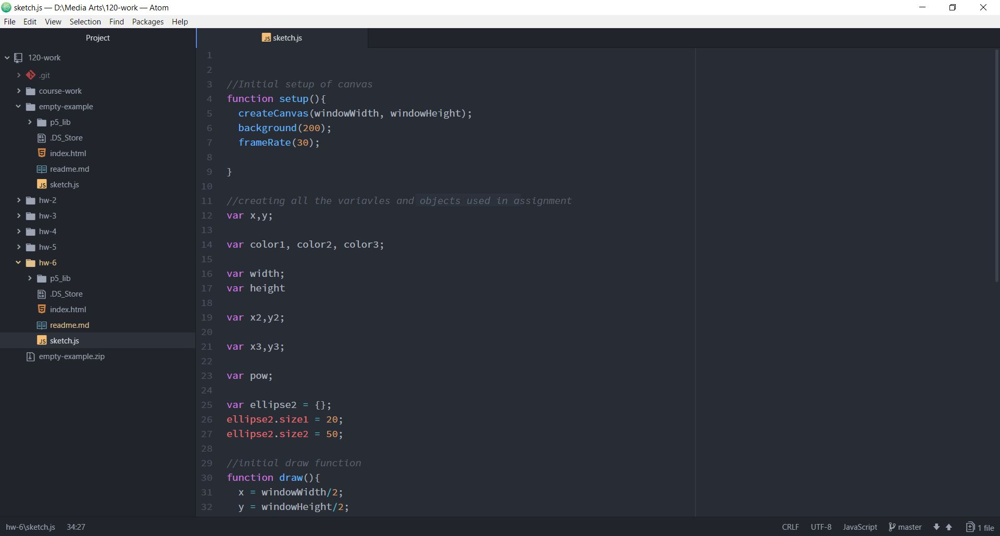

Marc Lenahan, 50

[Algorithmic Sketch]( https://marclenahan.github.io/120-work/hw-6/)

# Homework 6 Responses

The work I tried to do this week was to create a sketch animation using algorithm as the driving tool to create the piece. I tried to incorporate a lot of what was asked for this week’s assignment, managing to add some things but not all the necessary components.

First, I started with creating the canvas back ground to get a very neutral color that as easy on the eyes. Then I started to play with a lot of formulas to create different shapes and colors. Because of how many different functions to used and trying to get a lot of the math right, I spent more time with trial and error then I did finalizing what I truly wanted.

I did not manage to post anything for feedback, I got to into the trial and error of the assignment that I never was at a certain point that my code was definitively broken without a small syntax error or just a simple miscalculation.

I learned a lot, I kind of want to spend more time playing around with my current sketch and update it more as I tend to play around with different functions and methods for the end result.

Unfortunately, I did not end up getting a chance to help out other classmates this week.
