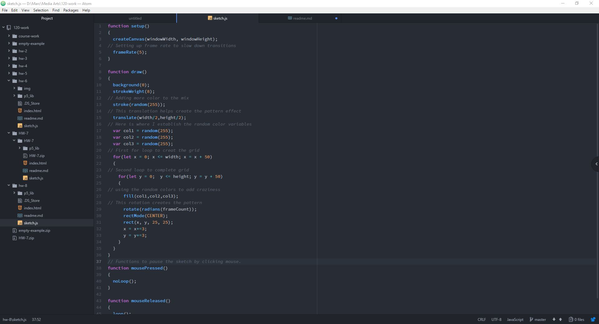

Marc Lenahan, 50

[for loop Sketch]( https://marclenahan.github.io/120-work/hw-8/)

# Homework 8 Responses
<!--1. Summarize the work you did this homework cycle. Paying particular attention to the individual choices you made.-->
The work I tried to do this week was a little complicated. My original plan was to go back to a previous assignment and basically improve it. As I tried to go through the old code I realized that there were still some elements that I was not able to smooth out in time of the deadline. After which I decided to start over and follow the guidelines set this week. The basis I went off of was trying to play and alter the code that was taught this week and see what I can create. To say the least I really liked the direction I went and how it turned out.

<!-- 2. What steps did you take to complete the assignment? -->
The steps I took was creating the basic functions and just added more and did a lot of trial and error. I felt that is what I’m am learning most from by testing each little thing I replace to see what changes. I started with ellipses and then made my way to rectangles. After that I started to add color to the mix. And then just started to clean up a lot of the work. Before my little purge I had maybe 5 iterations of my hw assignment.

<!-- 3. Did you have any problems or issues? How did you solve these? Did you post about these to the class repo issue tracker? Did you receive any useful feedback from your classmates? -->
Because of the method I was using to complete the assignment I had numerous problems. I was just able to contain them and not let them get out of hand so that I would be completely lost.

<!-- 4. Is there anything in particular you learned that you would like to discuss further? -->
For loops and while loops are essential to many programs and I think there would be so many benefits if for loops where incorporated in assignments more.

<!-- 5. What issues did you help your fellow classmates out with this past homework cycle? -->
I was playing around with this week’s lesson that I ended up not feeling too confident to answer any issues which is unfortunate on my part.
